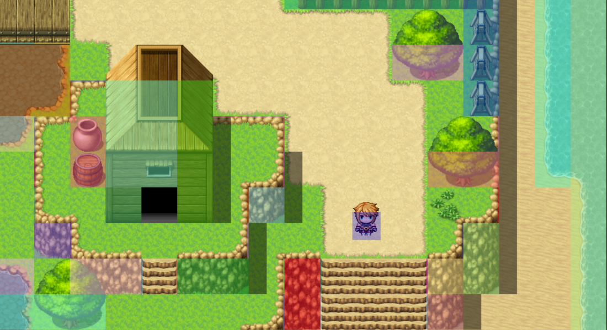

# FreeMove

### To-do
 - tiles into QTree
 - collision: characters 
 - collision: tiles
 - new movement with autoMove (`moveStraight()`)
 - change how autoMove is subtracted

---

## Objective
**RPG Maker MV** comes with a movement and collision system that fits well for its base use case: *non-continuous movement* on a grid with discrete jumps from one tile to another and smooth sprite movement across those tiles to facilitate that jump visually.

**FreeMove** attempts to offer a solution for games that require more responsive controls and desire game objects to move on a spectrum about the game map.

## Features

### Responsive Movement
**RPG Maker MV**'s smallest unit of movement distance is `1 tile`. When the shortest distance you can travel is greater than the `distancePerFrame()`, the character spends **multiple frames** executing the movement.

Base game movement is done in a cycle like so:
 - the player inputs movement in a direction
 - the `Game_Character` checks if movement is allowed into the adjacent tile in that direction
 - if passable, the `Game_Character` changes its `.x` and `.y` to that of the target tile
 - **WHILE** the character's `._realX`, `._realY` !== `._x`, `._y`
     - increment `._realX`, `._realY` <= `distancePerFrame()`
 - ^ repeat from top

The player is locked into the last movement vector input until the character reaches the destination tile. 

**Game movement can't be responsive if the player can't change its movement vector as soon as new information is presented.**
 
---

### FreeMove

`moveFree(direction)` **changes the smallest unit of movement distance to `distancePerFrame()`**. In so doing, movement begins and ends in the same frame. 

This is the new movement loop (a single frame):
 - the player inputs movement in a direction
 - the character moves up to `distancePerFrame()` in that direction (limited by collision)

**That's it.** The player chooses movement every frame.

---

### AutoMove
> Any autonomous movement that happens without continous input either from the player or a Move Route can be implemented with `autoMove(dx, dy)`.

We retain the tile-to-tile movement capacity of base **RPG Maker MV** by using `autoMove(...)` in 1 unit increments.

For example, Move Routes in the base game are constituted of `moveStraight(direction)` commands, which move the character 1 tile in any direction.

To replicate this behavior, we can use the following:
 - `moveStraight(2)` -> `autoMove(0, -1)`
 - `moveStraight(4)` -> `autoMove(-1, 0)`
 - `moveStraight(6)` -> `autoMove(1, 0)`
 - `moveStraight(8)` -> `autoMove(0, 1)`

In fact, the `moveStraight(...)` method is overwritten to execute just that.

We're not limited to 1 unit movements, however.

In order to get a character to move 8 tiles right across the map in the base game, we'd string together `moveStraight(6), moveStraight(6), moveStraight(6), ...` 8 times.

With `autoMove(...)`, we gain brevity and specificity: `autoMove(8, 0)`.

--- 

## Collision Properties

### Tilemap
Fully impassable tiles exist as 1x1 (48px-by-48px) collision objects on the tilemap. One-directional impassability is represented by a 0.1-thick (~5px) border within that tile.

### Characters 
Characters can have variable hitbox dimensions, specified by the `hitboxRadius` which is used to calculate their square hitbox dimensions. 

### Events
Enter the meta tag `<hitbox: x.x>` in an Event's **Note** to specify a particular `hitboxRadius` for the Event. 

Enter the same tag in a page's Event Command **Comment** to specify a particular `hitboxRadius` for the Event on a page-level. This will override the **Note** meta tag.

### Plugin Parameters
 - `display collision tiles` | Turn ON to display collision tiles (testing purposes).
- `tile color` | Specify CSS hex color (e.g., "#ff4136") for tiles. Use 'random' to view individual tiles.
- `display hitboxes` | Turn ON to display hitboxes (testing purposes).
- `hitbox color` | Specify CSS hex color (e.g., "#ff4136") for hitboxes.
- `character hitbox radius` | Default distance (in tiles) from center of characters used to calculate square hitbox.

---

## API 

### `Game_CharacterBase.moveFree(direction)`
